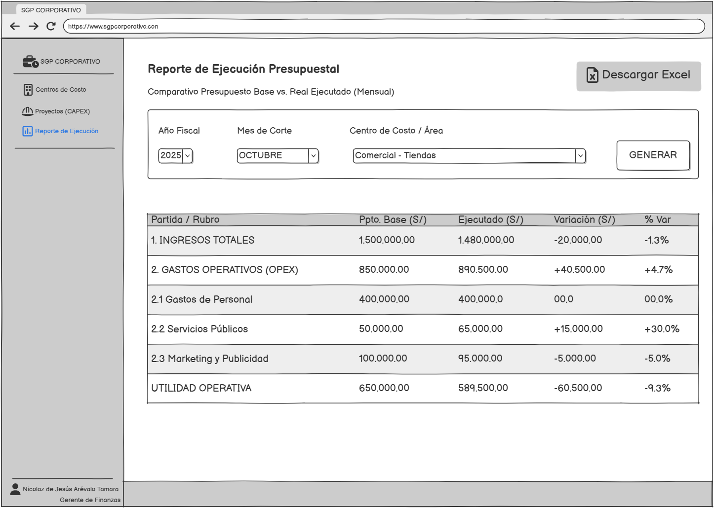

# Sistema de gestión presupuestal

Análisis y diseño de un sistema de información para integrar la planificación presupuestal, los gastos operativos (**OPEX**), las inversiones (**CAPEX**) y el control de ejecución.

Proyecto académico desarrollado en **Fundamentos de Sistemas de Información (1INF28)**, Pontificia Universidad Católica del Perú, **2025**.

## Problema de negocio

La gestión presupuestal combina hojas de cálculo, archivos compartidos y registros en el ERP. La consolidación manual demanda revisiones de formatos, cuentas contables y centros de costo. A su vez, las solicitudes por correo dificultan el seguimiento de responsables, decisiones y ajustes presupuestales.

El proyecto plantea centralizar la información, validar los registros y facilitar la comparación entre presupuesto y ejecución para apoyar el control de gestión.

## Alcance

El trabajo comprende el levantamiento de información, el análisis de procesos, la especificación de requerimientos, el modelado conceptual de datos y el diseño de prototipos de baja fidelidad.

| Entregable | Contenido |
| --- | --- |
| Análisis del negocio | 10 subprocesos de planificación y control presupuestal. |
| Requerimientos | 14 eventos de negocio y 16 requerimientos funcionales. |
| Modelo de datos | 9 entidades y 75 atributos. |
| Modelo de procesos | 16 DFD y un diccionario de 30 procesos. |
| Prototipos | 2 menús por rol y 4 pantallas principales. |

## Vista del proyecto

*Prototipo de baja fidelidad del reporte de ejecución presupuestal, elaborado en Balsamiq Wireframes.*

## Documentación

| Documento | Contenido |
| --- | --- |
| [Análisis del negocio](docs/01-business-analysis.md) | Contexto, actores, proceso actual y propuesta. |
| [Requerimientos funcionales](docs/02-requirements.md) | Catálogo RF-01 a RF-16 y reglas de negocio. |
| [Modelo conceptual de datos](docs/03-data-model.md) | DER, entidades, relaciones y decisiones de modelado. |
| [Modelo de procesos](docs/04-process-model.md) | Diagramas de flujo de datos por requerimiento. |
| [Diseño de interfaces](docs/05-interface-design.md) | Navegación por rol y prototipos de los módulos principales. |
| [Diccionario de entidades](data-model/entities.md) | Definición y propósito de cada entidad. |
| [Diccionario de atributos](data-model/data-dictionary.md) | Identificadores, campos y significado de los datos. |
| [Diccionario de procesos](docs/process-dictionary.md) | Operaciones de registro, consulta, validación y aprobación. |
| [Matriz de trazabilidad](docs/traceability.md) | Relación entre eventos, requerimientos, procesos y datos. |
| [Lecciones aprendidas](docs/lessons-learned.md) | Aprendizajes del análisis, modelado y prototipado. |

## Funcionalidades propuestas

- Registro de presupuesto y ejecución por cuenta contable, centro de costo y periodo.
- Gestión de solicitudes de ampliación presupuestal y registro de decisiones.
- Evaluación y seguimiento de proyectos de inversión CAPEX.
- Análisis de variaciones entre montos presupuestados y ejecutados.
- Consolidación de información financiera y carga del presupuesto aprobado al ERP.
- Consulta de indicadores y alertas mediante dashboards con filtros.

## Equipo y participación

**Equipo 8:** Favio César Suárez Rique, Mauro Sebastian Ramón Bullón y Nicolaz de Jesús Arévalo Tamara.

**Mi participación — Favio César Suárez Rique:** elaboración de diagramas de flujo de datos, diagrama entidad-relación, diseño de wireframes, análisis de procesos del negocio y contribución a la documentación del proyecto.

## Métodos y herramientas

- Cuestionarios y entrevistas para el levantamiento de información.
- Análisis de eventos y requerimientos funcionales.
- Diagrama entidad-relación y diccionarios de datos.
- Diagramas de flujo de datos.
- Prototipado de baja fidelidad con **Balsamiq Wireframes**.
