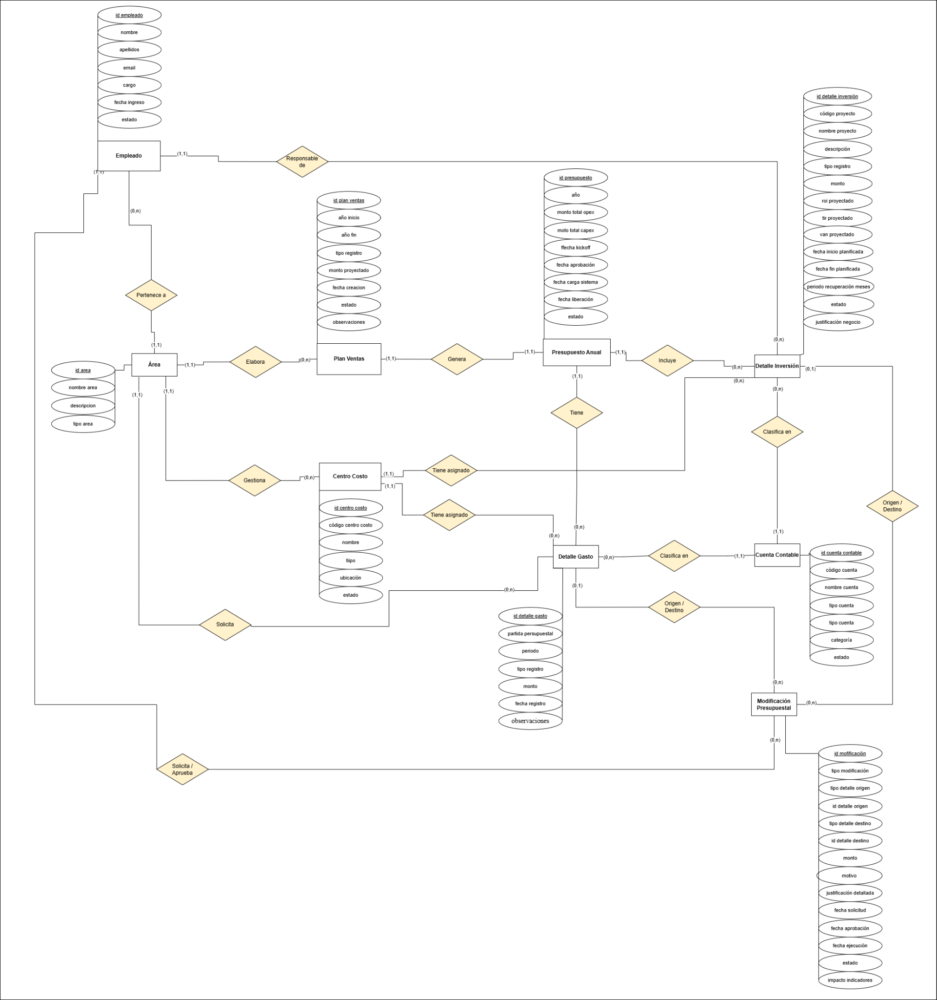

# Modelo conceptual de datos

El modelo organiza la información en **nueve entidades**, relacionadas con la estructura de la organización, la planificación anual, los detalles presupuestales y las solicitudes de modificación.

[Ver diagrama entidad-relación](../assets/data-model/er-diagram.png)

## Organización del modelo

| Grupo | Entidades | Propósito |
| --- | --- | --- |
| Organización | Empleado, Área | Identificar participantes y responsabilidades. |
| Planificación | Plan Ventas, Presupuesto Anual | Relacionar las proyecciones comerciales con el presupuesto del ejercicio. |
| Detalle presupuestal | Detalle Gasto, Detalle Inversión | Registrar OPEX y CAPEX presupuestados o ejecutados. |
| Clasificación | Centro Costo, Cuenta Contable | Asignar y clasificar los registros. |
| Modificaciones | Modificación Presupuestal | Gestionar ampliaciones y traslados. |

## Decisiones de modelado

| Decisión | Propósito |
| --- | --- |
| Diferenciar presupuesto y ejecución mediante `tipo registro` | Facilitar la comparación dentro de los detalles de gasto e inversión. |
| Separar OPEX y CAPEX | Conservar los atributos propios del gasto mensual y de los proyectos de inversión. |
| Reunir ampliaciones y traslados en Modificación Presupuestal | Compartir monto, justificación, fechas y estado. |
| Usar Centro Costo y Cuenta Contable como clasificadores | Mantener una imputación consistente de los recursos. |
| Vincular Plan Ventas con Presupuesto Anual | Representar el origen comercial de la planificación. |

## Relaciones principales

| Relación | Significado |
| --- | --- |
| Empleado - Área | Adscripción del personal a una unidad funcional. |
| Área - Plan Ventas | Responsabilidad sobre la elaboración del plan. |
| Plan Ventas - Presupuesto Anual | Relación entre la proyección de ventas y el presupuesto. |
| Presupuesto Anual - Detalle Gasto | Agrupación de las líneas de gasto operativo. |
| Presupuesto Anual - Detalle Inversión | Agrupación de las inversiones del ejercicio. |
| Área - Centro Costo | Gestión de los centros de costo. |
| Centro Costo - Detalle Gasto / Detalle Inversión | Asignación de gastos e inversiones a una unidad o ubicación. |
| Cuenta Contable - Detalle Gasto / Detalle Inversión | Clasificación contable de los registros. |
| Área - Detalle Gasto | Identificación del área solicitante. |
| Empleado - Detalle Inversión | Responsabilidad sobre el proyecto. |
| Empleado - Modificación Presupuestal | Participación en la solicitud y aprobación de ajustes. |
| Modificación Presupuestal - Detalle Gasto / Detalle Inversión | Identificación del detalle afectado como origen o destino. |

## Datos de planificación y ejecución

`Detalle Gasto` identifica la partida, el periodo mensual y el monto. `Detalle Inversión` reúne los datos del proyecto, sus fechas planificadas y los indicadores de rentabilidad. Ambos incluyen un tipo de registro para distinguir importes presupuestados y ejecutados.

`Modificación Presupuestal` identifica el tipo de operación, el detalle de origen y, cuando corresponde, el destino. También conserva la justificación y las fechas de solicitud, aprobación y ejecución.

## Diccionarios

- [Diccionario de entidades](../data-model/entities.md).
- [Diccionario de atributos](../data-model/data-dictionary.md).

[Matriz de trazabilidad](traceability.md) · [Inicio](../README.md)
