# Modelo de procesos del sistema

Los diagramas de flujo de datos describen cómo circula la información entre actores, procesos y almacenes. Cada DFD se relaciona con un requerimiento funcional y permite identificar entradas, transformaciones, validaciones y resultados.

## Notación

| Símbolo | Significado |
| --- | --- |
| Rectángulo | Actor o entidad externa. |
| Círculo | Proceso que transforma información. |
| Dos líneas horizontales | Almacén de datos. |
| Flecha etiquetada | Flujo de información. |

## Diagramas por requerimiento

### RF-01: Registrar detalle presupuestal

Actor principal: **Jefe de Área**. Procesos asociados en el diccionario: P-01, P-02.

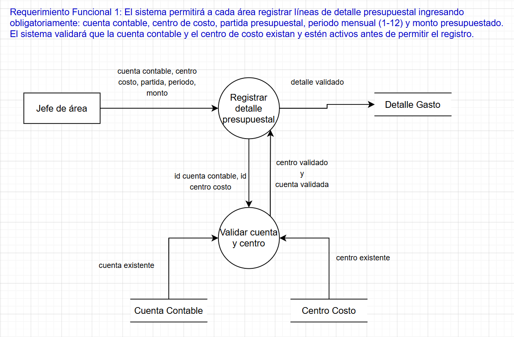

[Requerimiento](02-requirements.md#rf-01) · [Ver diagrama](../assets/dfds/rf-01.png)

### RF-02: Consultar información histórica

Actor principal: **Subgerente de Finanzas / usuario autorizado**. Procesos asociados en el diccionario: P-03, P-04.

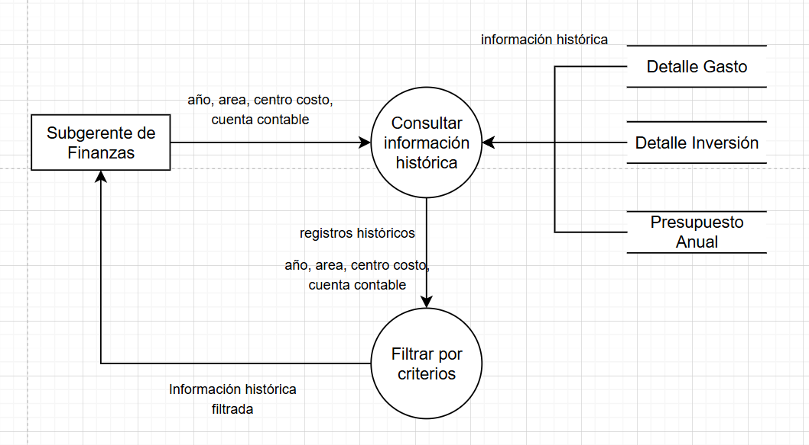

[Requerimiento](02-requirements.md#rf-02) · [Ver diagrama](../assets/dfds/rf-02.png)

### RF-03: Solicitar ampliación presupuestal

Actor principal: **Jefe de Área**. Procesos asociados en el diccionario: P-05.

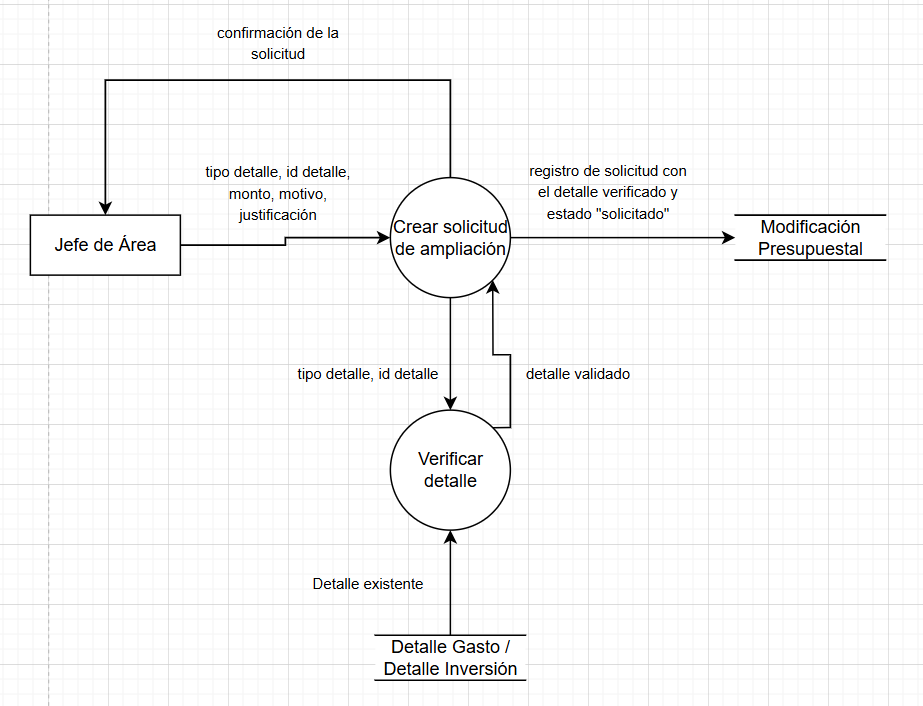

[Requerimiento](02-requirements.md#rf-03) · [Ver diagrama](../assets/dfds/rf-03.png)

### RF-04: Consultar solicitudes pendientes

Actor principal: **Jefe de Área / Subgerente de Finanzas**. Procesos asociados en el diccionario: P-06.

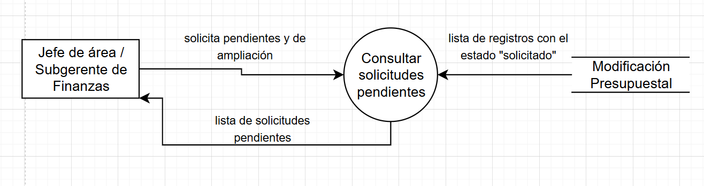

[Requerimiento](02-requirements.md#rf-04) · [Ver diagrama](../assets/dfds/rf-04.png)

### RF-05: Aprobar o rechazar solicitudes

Actor principal: **Jefe de Área / Subgerente de Finanzas**. Procesos asociados en el diccionario: P-07, P-08.

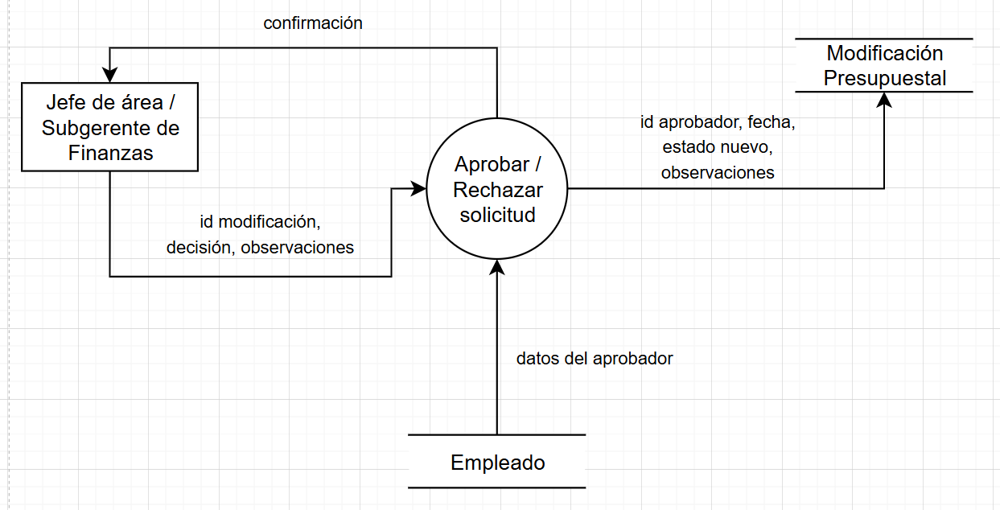

[Requerimiento](02-requirements.md#rf-05) · [Ver diagrama](../assets/dfds/rf-05.png)

### RF-06: Registrar y evaluar proyectos CAPEX

Actor principal: **Responsable de Proyecto**. Procesos asociados en el diccionario: P-09, P-10.

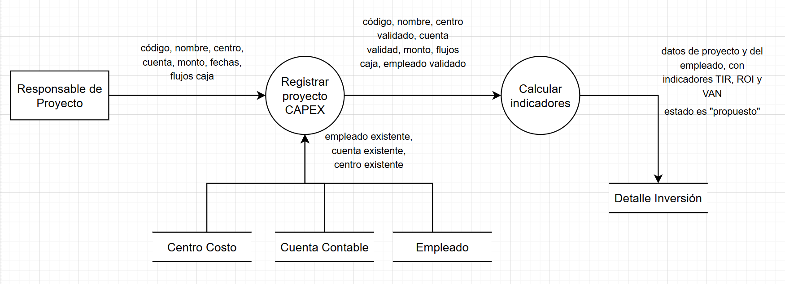

[Requerimiento](02-requirements.md#rf-06) · [Ver diagrama](../assets/dfds/rf-06.png)

### RF-07: Consultar proyectos propuestos

Actor principal: **Comité de Inversiones**. Procesos asociados en el diccionario: P-11.

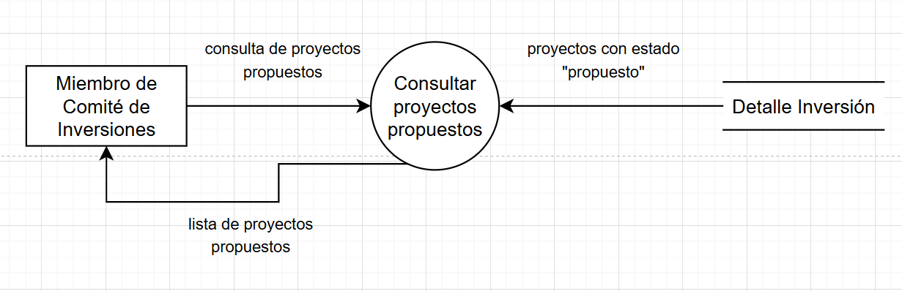

[Requerimiento](02-requirements.md#rf-07) · [Ver diagrama](../assets/dfds/rf-07.png)

### RF-08: Registrar aprobación de proyectos CAPEX

Actor principal: **Comité de Inversiones**. Procesos asociados en el diccionario: P-12.

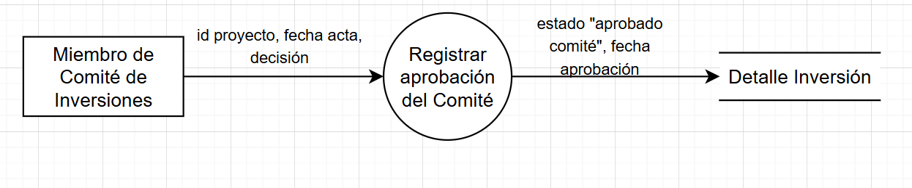

[Requerimiento](02-requirements.md#rf-08) · [Ver diagrama](../assets/dfds/rf-08.png)

### RF-09: Solicitar ampliación CAPEX

Actor principal: **Responsable de Proyecto**. Procesos asociados en el diccionario: P-13, P-14.

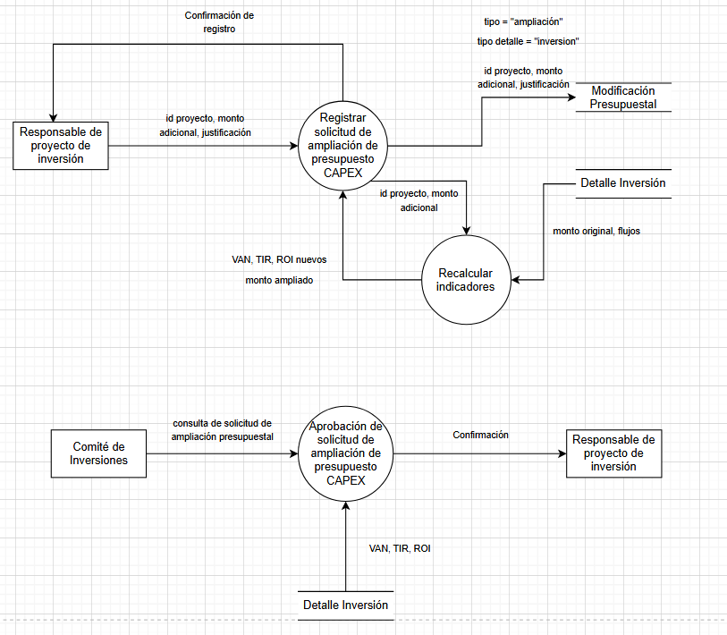

[Requerimiento](02-requirements.md#rf-09) · [Ver diagrama](../assets/dfds/rf-09.png)

### RF-10: Resolver ampliaciones CAPEX

Actor principal: **Comité de Inversiones**. Procesos asociados en el diccionario: P-15, P-16.

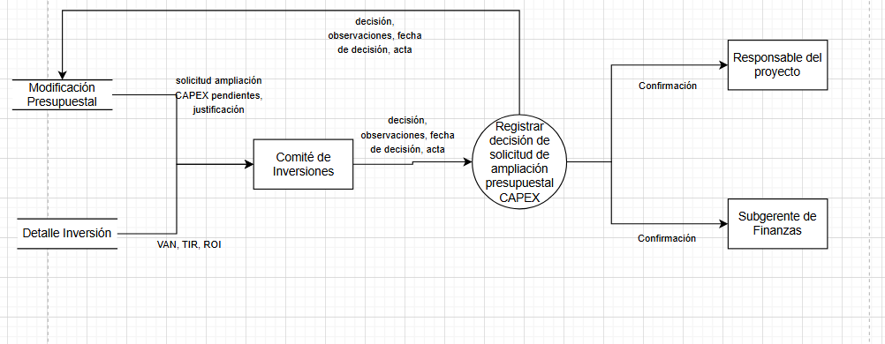

[Requerimiento](02-requirements.md#rf-10) · [Ver diagrama](../assets/dfds/rf-10.png)

### RF-11: Registrar ejecución presupuestal mensual

Actor principal: **Contabilidad**. Procesos asociados en el diccionario: P-17, P-18.

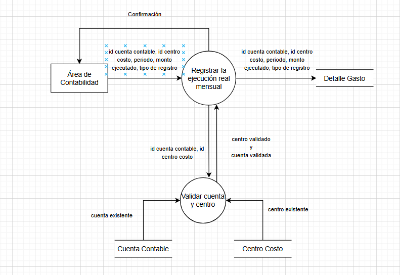

[Requerimiento](02-requirements.md#rf-11) · [Ver diagrama](../assets/dfds/rf-11.png)

### RF-12: Analizar variaciones presupuestales

Actor principal: **Subgerente de Finanzas**. Procesos asociados en el diccionario: P-19, P-20.

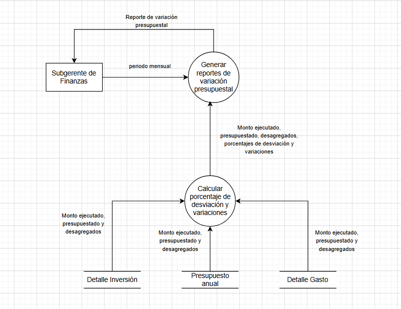

[Requerimiento](02-requirements.md#rf-12) · [Ver diagrama](../assets/dfds/rf-12.png)

### RF-13: Generar estados financieros consolidados

Actor principal: **Subgerente de Finanzas**. Procesos asociados en el diccionario: P-21, P-22.

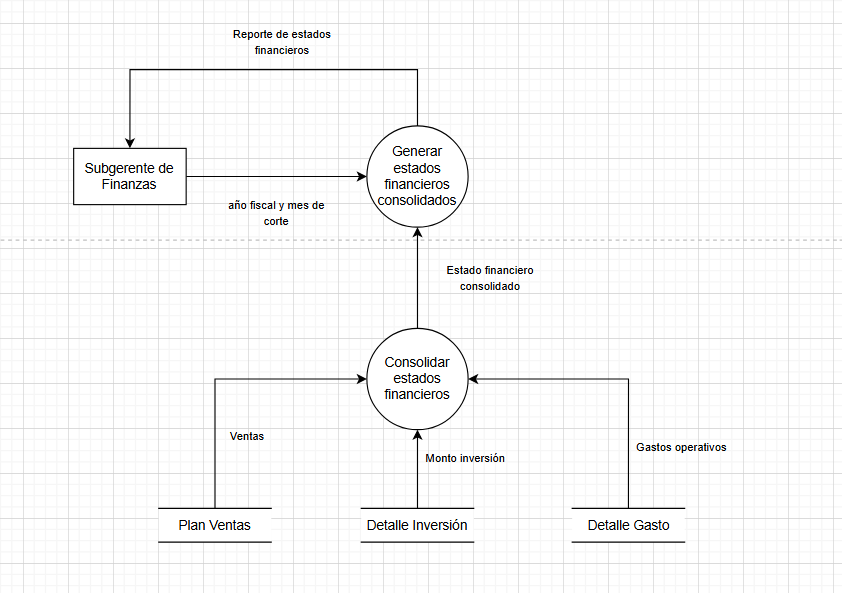

[Requerimiento](02-requirements.md#rf-13) · [Ver diagrama](../assets/dfds/rf-13.png)

### RF-14: Registrar aprobación del presupuesto anual

Actor principal: **Subgerente de Finanzas**. Procesos asociados en el diccionario: P-23, P-24.

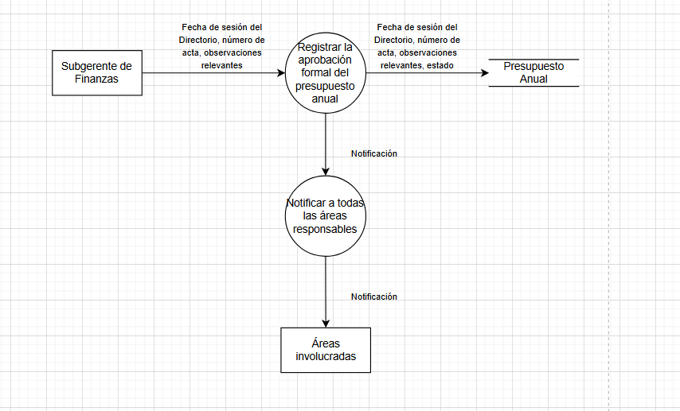

[Requerimiento](02-requirements.md#rf-14) · [Ver diagrama](../assets/dfds/rf-14.png)

### RF-15: Cargar el presupuesto aprobado al ERP

Actor principal: **Subgerente de Finanzas**. Procesos asociados en el diccionario: P-25, P-26, P-27.

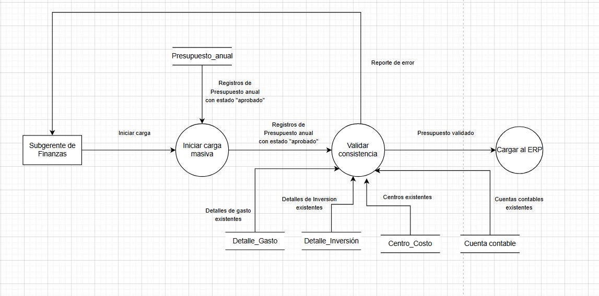

[Requerimiento](02-requirements.md#rf-15) · [Ver diagrama](../assets/dfds/rf-15.png)

### RF-16: Consultar dashboard presupuestal

Actor principal: **Usuario autorizado**. Procesos asociados en el diccionario: P-28, P-29, P-30.

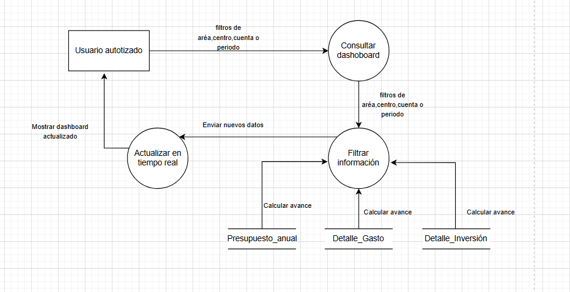

[Requerimiento](02-requirements.md#rf-16) · [Ver diagrama](../assets/dfds/rf-16.png)

## Flujos principales

- **Registro presupuestal:** el Jefe de Área proporciona los datos de la partida; las validaciones comprueban la cuenta contable y el centro de costo antes del registro.
- **Ampliación presupuestal:** el solicitante identifica el detalle y sustenta el monto adicional; los responsables consultan la solicitud y registran su decisión.
- **Gestión CAPEX:** el responsable propone una inversión, se evalúan sus indicadores y el comité registra la aprobación. Los incrementos de presupuesto siguen una evaluación de impacto.
- **Control mensual:** Contabilidad registra la ejecución y Finanzas consulta las variaciones por cuenta, centro y periodo.
- **Consolidación y carga:** el presupuesto aprobado se valida y se transfiere al ERP para su gestión operativa.

[Diccionario de procesos](process-dictionary.md) · [Matriz de trazabilidad](traceability.md) · [Inicio](../README.md)
