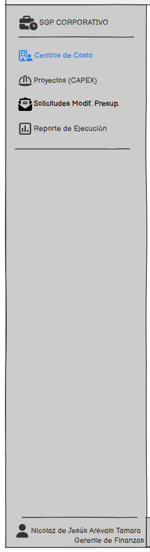
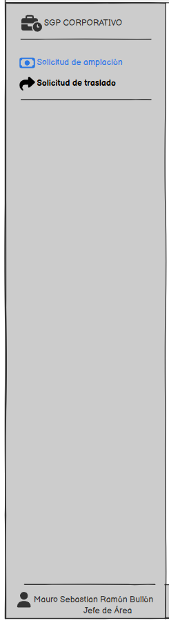
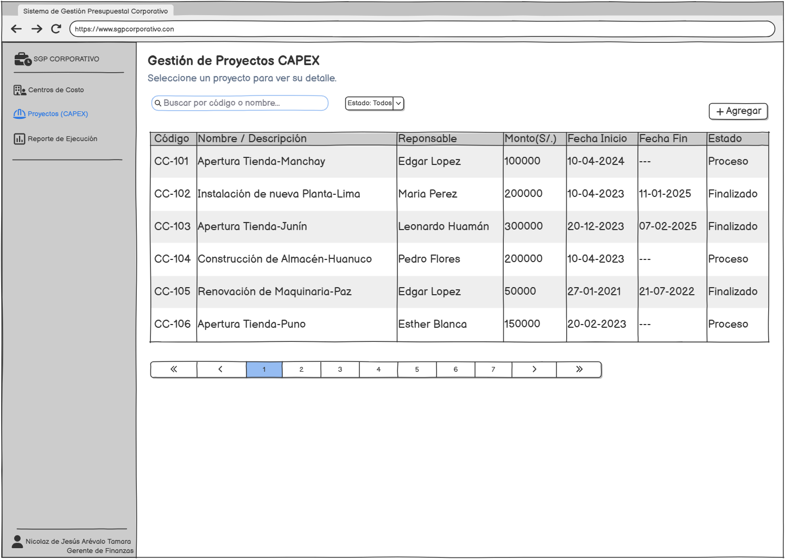
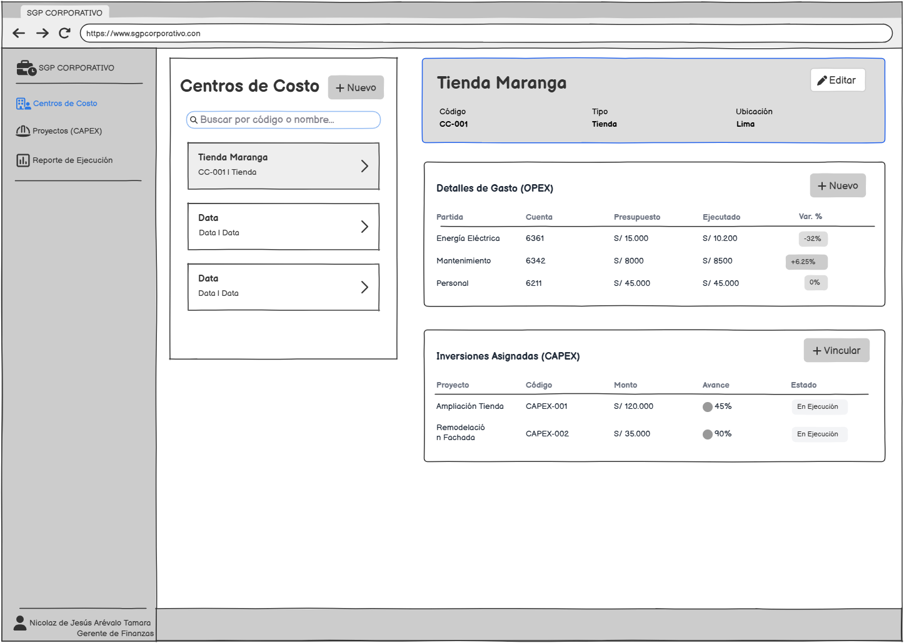
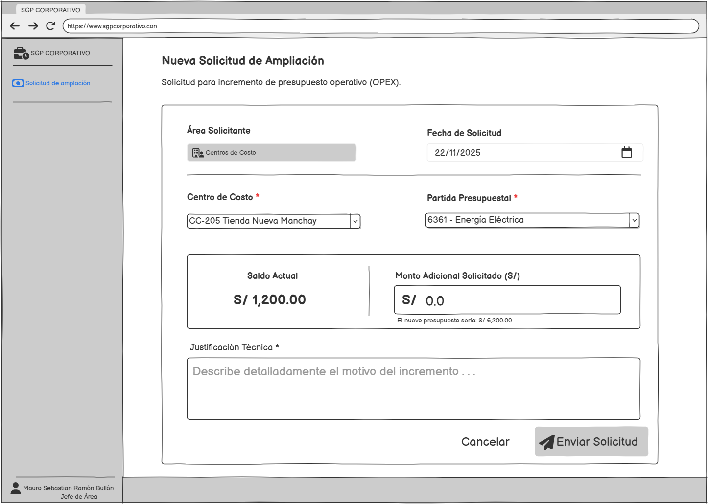

# Diseño de interfaces

Los prototipos de baja fidelidad, elaborados con **Balsamiq Wireframes**, presentan la navegación, la distribución de información y las acciones principales del sistema. El diseño se centra en las tareas de Finanzas y de los Jefes de Área.

## Navegación por rol

| Finanzas | Jefe de Área |
| --- | --- |
|  |  |

El menú de Finanzas agrupa centros de costo, proyectos CAPEX, solicitudes de modificación y reportes. El menú del Jefe de Área concentra las solicitudes de ampliación y traslado presupuestal.

## Gestión de proyectos CAPEX



La pantalla organiza los proyectos de inversión en un listado con búsqueda por código o nombre, filtro por estado y paginación. Cada registro presenta su responsable, monto, fechas y estado.

Las acciones principales son agregar un proyecto y seleccionar uno existente para consultar su detalle. Esta vista apoya los requerimientos de registro y consulta de inversiones: **RF-06 y RF-07**.

## Centros de costo y detalles presupuestales



La interfaz utiliza un diseño maestro-detalle. El panel izquierdo permite buscar y seleccionar el centro de costo; el panel derecho reúne su identificación, los gastos operativos y las inversiones asignadas.

La sección OPEX compara presupuesto, ejecución y variación por partida y cuenta contable. La sección CAPEX presenta los proyectos vinculados, sus montos, avance y estado. Las acciones permiten administrar el centro y sus registros asociados.

Esta vista se relaciona con **RF-01, RF-11, RF-12 y RF-16**.

## Solicitud de ampliación presupuestal



El formulario de ampliación OPEX reúne la información del solicitante, la fecha, el centro de costo, la partida, el monto adicional y la justificación. La sección financiera presenta el saldo actual y una vista previa del importe resultante.

El flujo de interacción consiste en seleccionar la partida, ingresar el incremento, sustentar la solicitud y enviarla para evaluación. Los campos obligatorios y la validación de un monto positivo guían el registro. La solicitud queda asociada al usuario, la fecha y el estado inicial.

Corresponde a **RF-03**.

## Reporte de ejecución presupuestal


El reporte compara el presupuesto base con los importes ejecutados. Los filtros permiten seleccionar año fiscal, mes de corte y centro de costo o área. La matriz muestra rubro, presupuesto, ejecución, variación monetaria y variación porcentual.

Las acciones principales son generar el reporte y descargar la información en Excel. La vista apoya el análisis de **RF-12** y la consulta de **RF-16**.

### Cálculo de variaciones

```text
Variación monetaria = Ejecutado - Presupuesto base
Variación porcentual = (Ejecutado - Presupuesto base) / Presupuesto base × 100
```

La variación porcentual se calcula para un presupuesto base distinto de cero. Por ejemplo, un presupuesto de S/ 8 000 y una ejecución de S/ 8 500 producen una variación de S/ 500 y 6,25 %.

En gastos, una variación positiva indica sobreejecución y una negativa indica subejecución. La valoración de la desviación depende de la naturaleza de la partida: gasto o ingreso.

## Criterios de diseño

- Navegación agrupada según el rol del usuario.
- Búsqueda y filtros para localizar registros.
- Relación maestro-detalle para explorar centros de costo, gastos e inversiones.
- Identificación de campos obligatorios en los formularios.
- Retroalimentación sobre importes y resultados de registro.
- Presentación conjunta de presupuesto, ejecución y variaciones.

[Requerimientos funcionales](02-requirements.md) · [Inicio](../README.md)
